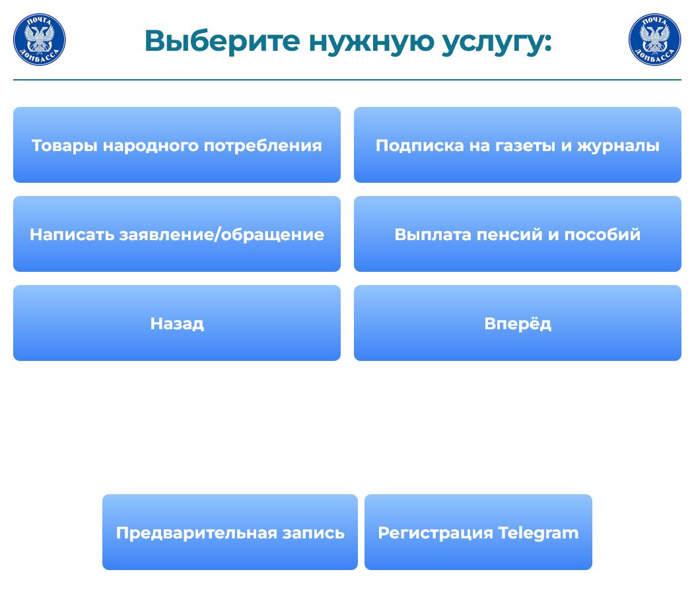
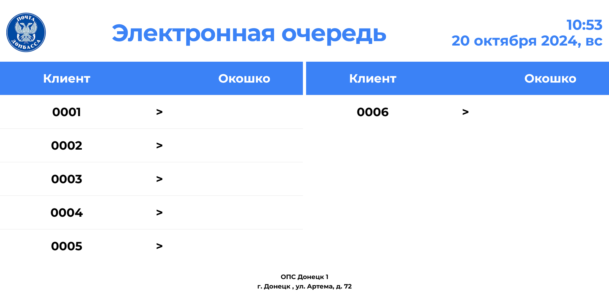

# Frontend - Клиент

Клиентская часть для отображения на терминалах управления очередью и экранах


Экран терминала СУО


Экран табло СУО

Основной стэк: `nextjs`, `react`, `typescript`

## Развертывание

### Docker

Приложение поддерживает развертывание в среде Docker Compose

### Ручное развертывание

1. Установить необходимые библиотеки

   ```bash
   npm ci
   ```

2. Определить переменные среды (см. .env)
3. Запустить проект

   ```bash
   npm run start
   ```

### Переменные среды

- `NEXT_PUBLIC_API_URL` - ссылка на API сервер
- `NEXT_PUBLIC_ORG_ID` - UUID организации, в которой установлен терминал
